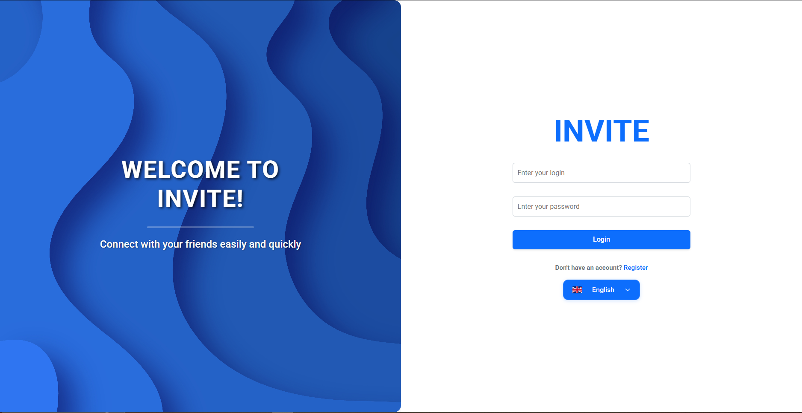

# 🚀 Invite-Redux

  

**Invite-Redux** is the evolution of the original **Invite** project, built to deepen understanding of full-stack web development. It offers user authentication, a global chat, multilingual support, and deploy-ready structure using modern technologies and international standards.

  
  
  
  
  
  

---

## 🔗 Quick Links

- 🌐 Access the project online: [invite-redux.vercel.app](https://invite-redux.vercel.app)
- 💾 GitHub repository: [github.com/YourUsername/INVITE-REDUX](https://github.com/YourUsername/INVITE-REDUX)

---

## 🎯 Objective

Build a functional full-stack web application that allows:

- User registration and authentication  
- Persistent data storage with JSON files  
- A global chat for logged-in users  
- Real-time multilingual switching (PT/EN)  
- Hosting on international platforms for production-ready deployment  

---

## 📲 Features

### 🔐 Authentication
- Secure login form with validation  
- Redirection to dashboard on successful login  
- User feedback on invalid credentials  

### 📝 Account Registration
- Signup form with:
  - Username
  - Login
  - Password
- Data is stored in a structured JSON file  
- Automatic redirect to login after registration  

### 💬 Global Chat
- Only accessible to authenticated users  
- All users can send and read messages  
- Simple shared messaging interface  

### 🌍 Multilingual Support
- Full internationalization with `i18next`  
- Toggle between **Portuguese** and **English**  
- Available on every page  

---

## 🌐 Internationalization Strategy

| Feature                     | Description                                   |
|----------------------------|-----------------------------------------------|
| Language Files             | `/src/i18n/en.json`, `/src/i18n/pt.json`      |
| Auto Detection             | Detects browser language preference           |
| Locale Formatting          | Date, time, and messages localized            |
| Add More Languages         | Contribute via PR with new JSON translation   |
| Global Delivery            | Vercel and Render offer CDN-based deployment  |

---

## 🛠️ Technologies Used

| Category   | Stack/Tool       | Description                          |
|------------|------------------|--------------------------------------|
| Frontend   | React + Vite     | Fast SPA with modular architecture   |
| Styling    | HTML, CSS        | Semantics and responsiveness         |
| Logic      | JavaScript (ES6) | Application logic and interactivity  |
| i18n       | i18next          | Internationalization library         |
| Backend    | PHP              | Lightweight server-side scripting    |
| Storage    | JSON             | Simple persistent data solution      |
| Deployment | Vercel + Render  | Global hosting for frontend/backend  |

---

## 🌍 Deployment

| Platform | Purpose      | URL / Status |
|----------|--------------|--------------|
| Vercel   | Frontend     | ✅ Deployed   |
| Render   | Backend API  | ✅ Deployed   |

---

## 📌 Project Status

| Feature               | Status |
|------------------------|--------|
| Registration system    | ✅     |
| Login system           | ✅     |
| JSON database          | ✅     |
| Chat functionality     | ✅     |
| i18n (EN/PT) support   | ✅     |
| Deployed frontend      | ✅     |
| Deployed backend       | ✅     |
| International focus    | 🟢     |

---

## 🧩 Future Improvements

- [ ] Replace JSON with relational DB (PostgreSQL)  
- [ ] Implement JWT-based authentication  
- [ ] Use WebSockets for real-time chat  
- [ ] Responsive mobile-first redesign  
- [ ] Admin panel for message moderation  

---

## 👨‍💻 Developer

**Name:** [Your Name]  
**Role:** Frontend Developer  
**Tech Stack:** React, PHP, Vite, JSON  
**Portfolio / GitHub:** [your-link]  
**Contact:** [email@example.com]

---

## 📄 License

Distributed under the MIT License. See `LICENSE` for more information.
